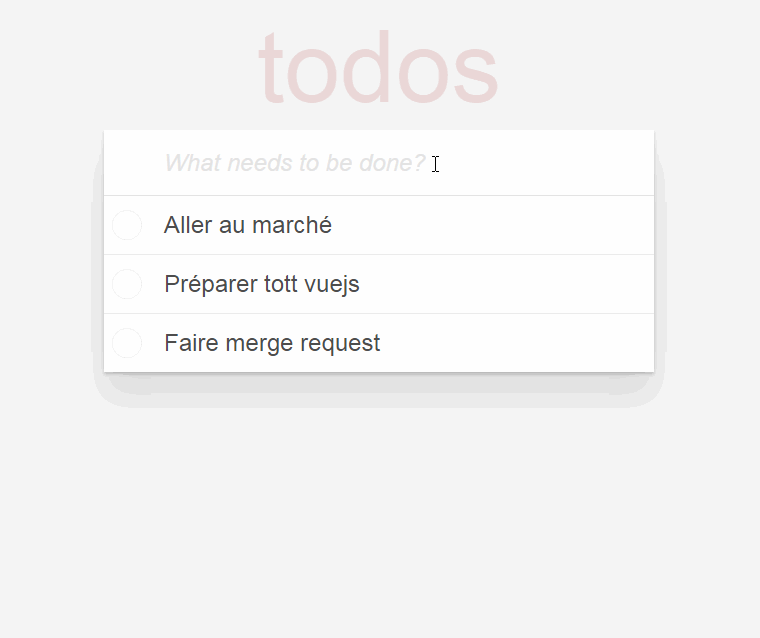

---?image=vue.jpg

---

- Vuejs (lire `view js`) released in 2014
- Vue 2 in 2016
- Vue.js offre un `two-way data binding` (comme sur AngularJS), server-side rendering (like in Angular2 and ReactJS), Vue-cli (scaffolding tool for quick start)

---

### L'instance Vue

- `el`: element où greffer vuejs dans le DOM
- `data`: toutes les variables qu’on souhaite injecter
- `methods`: méthodes utilisées dans les directives
- etc. (voir [Vue api](https://vuejs.org/v2/api))

+++

### L'instance Vue

Un exemple:

```html
<div id="app">
  {{ message }}
</div>
```
```javascript
new Vue({
  el: '#app',
  data: {
    message: 'Hello Vue!'
  }
})
```

---

### Quelques directives

**v-bind : 'Binder' un attribut**

`v-bind` ou simplement `:` (deux points)

- `v-bind:href` devient `:href`
- `v-bind:title` devient `:title`

```html
<div id="app">
  <span v-bind:title="message"> {{ message }} </span>
</div>
```

+++

### Quelques directives

**v-on : Appel d'un événement (une méthode)**

`v-on` ou simplement `@` (arobase)

- `v-on:click` devient `@click`
- `v-on:change` devient `@change`
- `v-on:keyup.enter` ou `@keyup.enter` (clic sur la touche Enter)

+++

### Quelques directives

**v-on : Appel d'un événement (une méthode)**

```html
<div id="app">
  <span @click="hello"> {{ message }} </span>
</div>
```
```javascript
new Vue({
  el: '#app',
  data: {
    message: 'Hello Vue!'
  },
  methods: {
    hello: function() { 
      alert(this.message); 
    }
  }
})
```

+++

### Quelques directives

**v-on : Appel d'un événement (une méthode)**

Modificateurs :
- `prevent`: prevent default
- `stop`: stop propagation
- `once`: just once
- `lazy`: binding on blur

+++

### Autres directives

- `v-if`, `v-else`: condition
- `v-for`: loop
- `v-model`: 2 way data binding

---?image=workout.jpg

### Objectif : Faire avec Vue une petite application de TODO comme TodoMVC



---

### Exercice 1


*TODO*: Recupérer la branche `step0` et suivre les indications pour afficher une liste de TODOs statiques. 

---

### Créer ses directives

```javascript
Vue.directive('focus', {
  bind: function(el, binding, vnode) {},
  inserted: function(el, binding, vnode) {},
  update: function(el, binding, vnode, oldVnode) {},
  componentUpdated: function(el, binding, vnode, oldVnode) {},
  unbind: function(el, binding, vnode) {}
})
```

+++

### Créer ses directives

```html
<div id="example" v-demo:foo.a.b="message"></div>
```

```javascript
Vue.directive('demo', {
  bind: function (el, binding, vnode) {
    var s = JSON.stringify
    el.innerHTML =
      'name: '       + s(binding.name) + '<br>' +
      'value: '      + s(binding.value) + '<br>' +
      'expression: ' + s(binding.expression) + '<br>' +
      'argument: '   + s(binding.arg) + '<br>' +
      'modifiers: '  + s(binding.modifiers) + '<br>' +
      'vnode keys: ' + Object.keys(vnode).join(', ')
  }
})

new Vue({
  el: '#example',
  data: {
    message: 'hello!'
  }
})
```

+++

### Créer ses directives

```
name: "demo"
value: "hello!"
expression: "message"
argument: "foo"
modifiers: {"a":true,"b":true}
vnode keys: tag, data, children, text, elm, ns, context, functionalContext, key, componentOptions, componentInstance, parent, raw, isStatic, isRootInsert, isComment, isCloned, isOnce
```

---?image=workout.jpg

### Exercice 2

*TODO*: Suivre les indications sur la branche `step1` afin de créer notre propre directive `v-todo-focus`. Celle ci 
donne le focus au todo sur lequel on double clique pour l'éditer dans la liste des todos.  

---

### Filtres

Caractérisé par le symbole pipe `|`
 
```html
<!-- in mustaches -->
{{ message | capitalize }}

<!-- in v-bind -->
<div v-bind:id="rawId | formatId"></div>
```

Les computed properties pour une utilisation plus avancée des filtres

+++

### Filtres

Dans notre cas:
 
```javascript
Vue.filter('capitalize', function (val) {
    return val.toUpperCase();
})
```

```html
<label @dblclick="editTodo(todo)">
    {{todo.text | capitalize}}
</label>
```

--- 

### Computed properties

- La propriété `data` est plus réservée aux expressions simples. 
- Privilégier la propriété `computed` quand c'est des expressions avec beaucoup de logique


+++ 

### Computed properties

Ne pas faire ça :
```html
<div id="example">
  {{ message.split('').reverse().join('') }}
</div>
```
```javascript
var vm = new Vue({
  el: '#example',
  data: {
    message: 'Hello'
  }
})
```

Mais plutôt ça :
```html
<div id="example">
  {{ reversedMessage }}
</div>
```
```javascript
var vm = new Vue({
  el: '#example',
  data: {
    message: 'Hello'
  }, 
  computed: {
      reversedMessage: function () {
        return this.message.split('').reverse().join('')
      }
  }
})
```

--- 

### Composants

**Encapsulation / réutilisation de code**

```javascript
Vue.component('my-component', {
  // options
})
```

```html
<div id="example">
  <my-component></my-component>
</div>
```

+++

### Composants

Vue component options:

- `data`: pareil que pour l'instance Vue. Mais une fonction cette fois ci.
- `props`: attriuts acceptés par le composant
- `template`: code html du composant

Voir [Component Options](http://012.vuejs.org/api/options.html) pour la liste complète des options.

---

### Exercice 3

*TODO*: Suivre les indications sur la branche `step2` afin de créer et d'utiliser les composants 
`todo-input` et `todo-list`.  

---

### La suite

- Single Page Components
- Vue Router
- [...]

---

### De la bonne documentation

- [Doc officiel](https://vuejs.org/v2/guide/)
- [Laracasts: Vue 2 step by step](https://laracasts.com/series/learn-vue-2-step-by-step)
- [Grafikart Vuejs tuto](https://www.grafikart.fr/formations/vuejs) 

---

### Solution TodoMVC

La solution est disponible sur la branche `master`